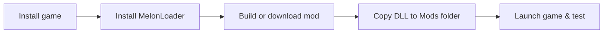

# 🎮 S1Toolkit — Schedule I Modding Framework

> **51 APIs · 252 methods · Zero Il2Cpp knowledge required.**
> Complete modding development environment for Schedule I (TVGS).

[](LICENSE)
[](https://dotnet.microsoft.com/)
[](https://store.steampowered.com/app/3164500/)
[](mod-source/S1Toolkit-api/Api/)
[](https://discord.gg/UD4K4chKak)

---

## 📥 Download & Install

**Release:** [Latest Version](https://github.com/domi7602/S1Toolkit/releases/latest)

1. Download `S1Toolkit.zip`
2. Extract the `.dll` files to `Schedule I/Mods/`
3. Launch the game — done.

## ⚡ Quick Start (for modders)

```csharp
using S1Toolkit.Api;

// Money, health, items — all without Il2Cpp knowledge:
Api.Money.Add(1000000);
Api.Player.SetHealth(100);
Api.Inventory.Add("cocaine", 50);
Api.Growing.Plant("weed_seed", 0, 1, 3);
Api.Time.SkipToMorning();
```

**[→ Complete API Reference](docs/api-reference.md)** (252 methods, LLM-optimized)

Want to *add* new content instead (custom quests, phone apps, NPCs)? Use the class-based **[S1Toolkit.Modules layer](docs/modules.md)** — inherit `Quest`, `PhoneApp`, or `NPC` and go.

## 📂 At a Glance

| Folder | What for? |
|--------|--------|
| [`mod-source/`](mod-source/) | **Mod projects** — S1Toolkit (4 tiers: slim/api/core/modules) |
| [`docs/`](docs/) | **Documentation** — API reference + Modules guide |
| [`Tools/`](Tools/) | **Tools** — Linter, project generator, LLM context, valid IDs |
| [`notes/`](notes/) | **Research notes** — game systems, decompilation findings (no quality guarantee) |

---

## 🚀 Getting Started (for absolute beginners)



### 1. Install MelonLoader
- Download & install [MelonLoader](https://melonwiki.xyz/) into the game directory
- Launch the game once → the `Mods/` folder is created automatically

### 2. Launch game & test
- A `Mods/` folder now exists in the game directory
- Every `.dll` in here is loaded automatically
- **On next launch** you'll see the mod in the MelonLoader console window

### 3. Milestones
1. ✅ MelonLoader installed
2. ✅ First `.dll` in the `Mods/` folder
3. ✅ Mod loads in-game
4. 🎉 Feature built!

---

## 🧠 Who finds what here

### 👶 New here? → `docs/`
[api-reference.md](docs/api-reference.md) covers the full static API; [modules.md](docs/modules.md) the class-based layer. Deep dives on game systems live in [`notes/`](notes/).

### 🤖 Using an LLM to write mods? → `Tools/LLM-CONTEXT.md`
One file with everything a small model needs: rules, template, API, valid IDs, fix loop.

### 🔧 Want to build a mod? → `mod-source/`
Clone a template, reference the API, and build. See the [README](mod-source/README.md) for setup instructions.

---

## ⚙️ Developer Tools

| Tool | Path | Purpose |
|------|------|-------|
| **S1Toolkit Tools** | [`Tools/`](Tools/) | Linter, mod generator, patterns, LLM context |
| **dnSpy** | *(external)* | .NET decompiler — turns DLLs into C# |
| **MelonLoader** | *(in game directory)* | Mod loader for Unity/Il2Cpp |
| **Rider / VS / VS Code** | *(your choice)* | IDE for coding |
| **.NET SDK 6.0+** | *(system-wide)* | For compiling mods |

---

## 📦 Deploy a Mod (quick)

```bash
# 1. Build mod
cd mod-source\MyMod
dotnet build -c Release

# 2. DLL was automatically copied to:
# C:\Program Files (x86)\Steam\steamapps\common\Schedule I\Mods\MyMod.dll

# 3. Launch game and test
```

---

## 📖 Useful Links

| Resource | URL |
|-----------|-----|
| Schedule I Modding Wiki | https://s1modding.github.io/ |
| MelonLoader Docs | https://melonwiki.xyz/ |
| S1API Framework | https://github.com/ifBars/S1API |
| Schedule I on Steam | https://store.steampowered.com/app/3164500/ |
| Nexus Mods | https://www.nexusmods.com/schedule1 |
| Thunderstore | https://thunderstore.io/c/schedule-i/ |

---

## 🔄 Updates & Changelog

See [`CHANGELOG.md`](CHANGELOG.md) for version history.

---

Copyright (c) 2026 domi7602
